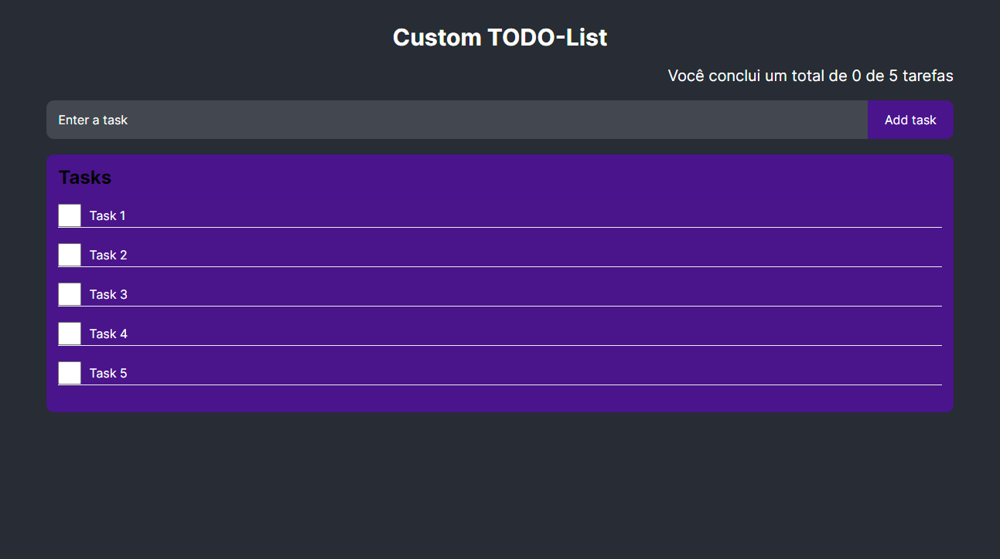

# Getting Started with Todo List App



This is an app to add tasks, they are simple because it was used for graduate studies at PUCMINAS.

## Characteristics:

useStates |
npx create-react-app |
Components |
JavaScript

## How to use:

Before you begin, make sure you have Node.js and npm (Node Package Manager) installed on your machine.

#### Clone this repository

```bash
$ git clone git@github.com:arks-lacerda/todo-list.git
```

#### Access project folder in terminal/cmd

```bash
$ cd /todo-list
```

#### Install the dependencies

```bash
$ npm install
```

#### Run the application in development mode

```bash
$ npm start
```

## Available Scripts

In the project directory, you can run:

### `npm start`

Runs the app in the development mode.\
Open [http://localhost:3000](http://localhost:3000) to view it in your browser.

## Technologies

- ReactJS

You can learn more in the [Create React App documentation](https://facebook.github.io/create-react-app/docs/getting-started).

To learn React, check out the [React documentation](https://reactjs.org/).

## 📝 License

This project is under the [MIT]() license. See the LICENSE file for more details.

## 🔎 My LinkedIn

<a href="https://www.linkedin.com/in/arks-lacerda/"></a>

<h3 align="center">Developed by Arthur Lacerda ☕</h3>
